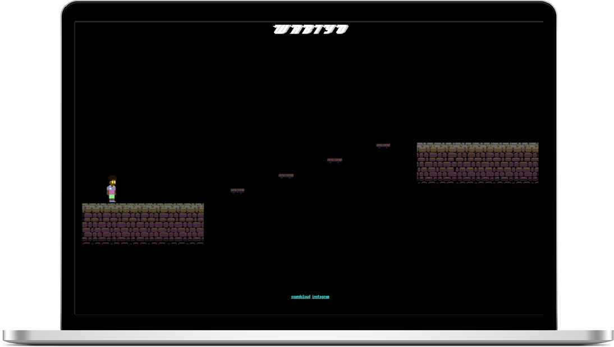
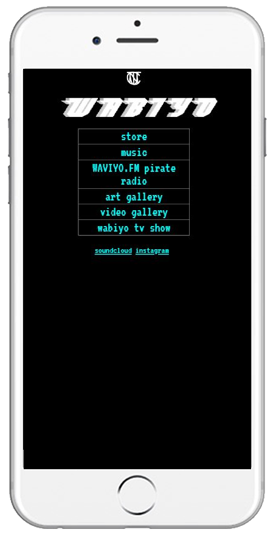

# Wabiyo website

Website and clothing store for creative collective wabiyo and clothing company Wabiyo. 

## Desktop JS Game

The desktop version of the site consists of a dungeon platformer game, written in javascript with the p5 module. The player/customer can play through the short game to find the item they want and check out.

## Mobile VR

The mobile version uses a simple layout though the background of the store is a Virtual-Reality scene controlled using the motion of the device, programmed and implemented using the A-FRAME VR framework. 

### Asset credit

Character assets created by Wabiyo, environment assets sourced from itch.io.

### Contact

Feel free to contact Wabiyo via DM on instagram or myself by email: zachary.molony@ada.ac.uk

  [Instagram](https://www.instagram.com/wab.iyo/)
    
 [Soundcloud](https://soundcloud.com/wabiyo)
